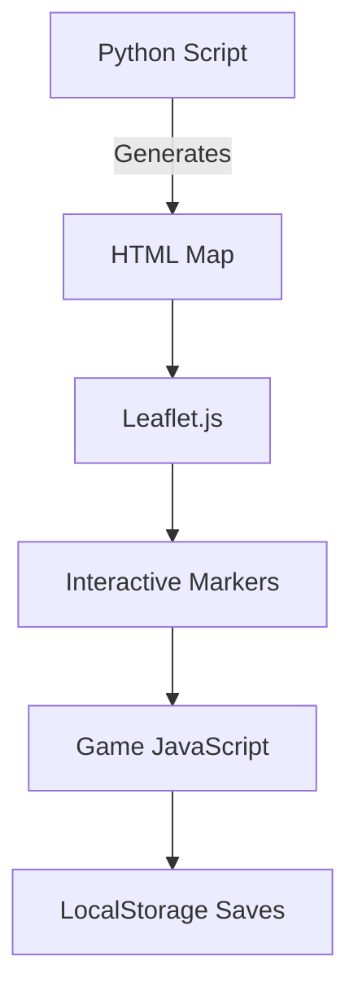

# 🧟♂️🗺️ Chicago Nightmare: D&D Apocalypse Survival (WIP)

## A hybrid digital battle map and survival game combining real Chicago data with Dungeons & Dragons 5e mechanics

  

## 📖 Table of Contents

- [🧟♂️🗺️ Chicago Nightmare: D\&D Apocalypse Survival (WIP)](#️️-chicago-nightmare-dd-apocalypse-survival-wip)
  - [A hybrid digital battle map and survival game combining real Chicago data with Dungeons \& Dragons 5e mechanics](#a-hybrid-digital-battle-map-and-survival-game-combining-real-chicago-data-with-dungeons--dragons-5e-mechanics)
  - [📖 Table of Contents](#-table-of-contents)
  - [🎮 Overview](#-overview)
  - [⚙️ Installation](#️-installation)
    - [Requirements](#requirements)
    - [Running the Game](#running-the-game)
  - [🎲 How to Play](#-how-to-play)
    - [🕹️ Core Gameplay](#️-core-gameplay)
    - [🎯 Action Examples](#-action-examples)
  - [📜 New to D\&D?](#-new-to-dd)
    - [🎲 Basic D\&D Concepts](#-basic-dd-concepts)
    - [🏆 Starter Tips](#-starter-tips)
  - [🏗️ System Architecture](#️-system-architecture)
  - [🧩 Customization](#-customization)
    - [Easy Tweaks](#easy-tweaks)
    - [Advanced Mods](#advanced-mods)
  - [🤝 Contributing](#-contributing)
  - [📜 License](#-license)

## 🎮 Overview

This project transforms Chicago into a post-apocalyptic playground with:

- **D&D 5e Rules**: Skill checks, combat rolls, and character progression
- **Real Map Data**: Actual Chicago landmarks and crime reports
- **Survival Gameplay**: Resource management and base defense
- **Interactive Story**: Three-act outbreak timeline

**Key Features**:

- Click-to-roll D20 system
- CR-rated zombie encounters
- Alignment-based faction interactions
- Persistent save system
- Tactical decision points

## ⚙️ Installation

### Requirements

- Python 3.10+
- Modern web browser (Chrome/Firefox recommended)

```bash
# Install dependencies
pip install folium pandas branca
```

### Running the Game

```bash
# Generate the map
python ultimate_apocalypse.py

# Open in browser (choose one):
start CHICAGO_NIGHTMARE_CAMPAIGN.html  # Windows
open CHICAGO_NIGHTMARE_CAMPAIGN.html   # Mac
xdg-open CHICAGO_NIGHTMARE_CAMPAIGN.html  # Linux
```

## 🎲 How to Play

### 🕹️ Core Gameplay

1. **Monitor Your Stats** (Top-right panel):
   - ❤️ HP: Your health (0 = game over)
   - 🎒 Supplies: Daily consumption (10/day)
   - 📅 Days: Survival time
   - ⚔️ Quests: Completed missions

2. **Key Interactions**:
   - Click any marker for actions
   - Use the timeline controls (bottom-left) to replay outbreak history
   - Toggle layers (top-right) to filter map elements

3. **Game Flow**:
   - Each in-game day lasts 30 real-world seconds
   - Random encounters occur at night
   - Complete quests to extend survival

### 🎯 Action Examples

| Location Type | Sample Actions |
|---------------|----------------|
| Safe House | "Long Rest" (Heal), "Scavenge" |
| Zombie Zone | "Fight", "Sneak Past" (Stealth check) |
| Faction Base | "Negotiate" (Persuasion/Intimidation) |
| Quest Giver | "Accept Mission" (CR-rated encounter) |

## 📜 New to D&D?

### 🎲 Basic D&D Concepts

**1. Ability Scores**:

- **STR** (Strength): Physical power
- **DEX** (Dexterity): Agility/reflexes  
- **CON** (Constitution): Stamina/health
- **INT** (Intelligence): Knowledge/logic
- **WIS** (Wisdom): Perception/insight  
- **CHA** (Charisma): Social skills

**2. Skill Checks**:

When you attempt an action, the game rolls a d20 and adds your relevant skill bonus:

```python
# Example: Trying to sneak past zombies
roll_result = d20() + stealth_bonus
success = roll_result >= difficulty_class(DC)
```

**3. Combat Basics**:

- **Attack Roll**: d20 + attack bonus vs target's Armor Class (AC)
- **Damage Roll**: Weapon dice (e.g., d6 for zombie claws)

### 🏆 Starter Tips

1. Always check your stats before engaging
2. Higher CR = harder fights (start with CR 1-2)
3. Use terrain to your advantage (hover over locations)
4. Rest often to recover HP

## 🏗️ System Architecture



**Key Components**:

- **Folium**: Renders Chicago map with custom markers
- **TimestampedGeoJson**: Handles the outbreak timeline
- **Custom JS Engine**: Manages D&D rules and state

## 🧩 Customization

### Easy Tweaks

```python
# In ultimate_apocalypse.py:

# Change difficulty
SUPPLIES_DECAY = 5  # Default: 10/day

# Add new locations
safe_houses.append({
    "name": "Your Location",
    "coords": [LAT, LONG],
    "supplies": 100
})
```

### Advanced Mods

1. **New Skill Checks**:

```javascript
// In the JS section:
function arcanaCheck() {
    return skillCheck('arcana', 15);
}
```

1. **Custom Events**:

```python
# Add to generate_story_features():
{
    "type": "Feature",
    "geometry": {"type": "Point", "coordinates": [LAT, LONG]},
    "properties": {
        "time": TIMESTAMP,
        "popup": "Your custom event text",
        "icon": "skull"
    }
}
```

## 🤝 Contributing

1. Fork the repository
2. Create your feature branch (`git checkout -b new-feature`)
3. Commit changes (`git commit -am 'Add awesome feature'`)
4. Push to branch (`git push origin new-feature`)
5. Open a Pull Request

**Suggested Improvements**:

- Additional Chicago landmarks
- More faction types
- Weather effects
- Multiplayer support

## 📜 License

MIT License - See [LICENSE](LICENSE) file

---

> *"In the apocalypse, the rules are simple: Roll high or die trying."*  

> - *The Wasteland DM's Guide*
